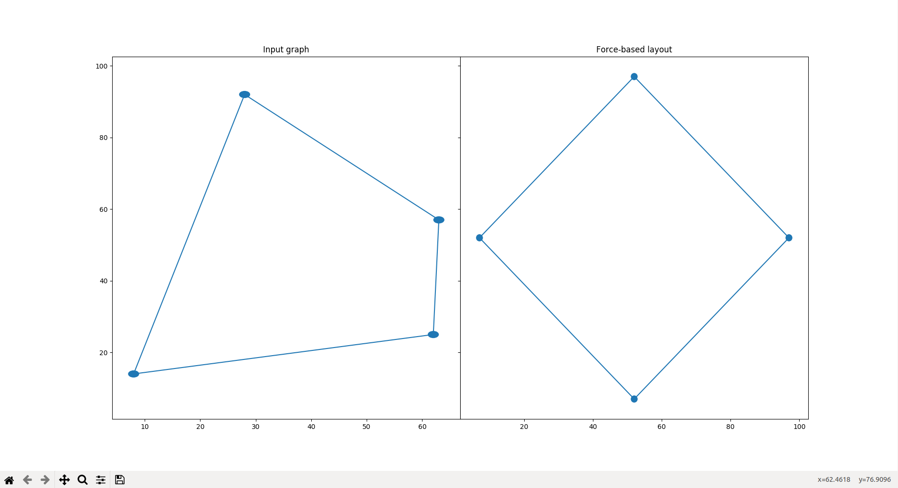
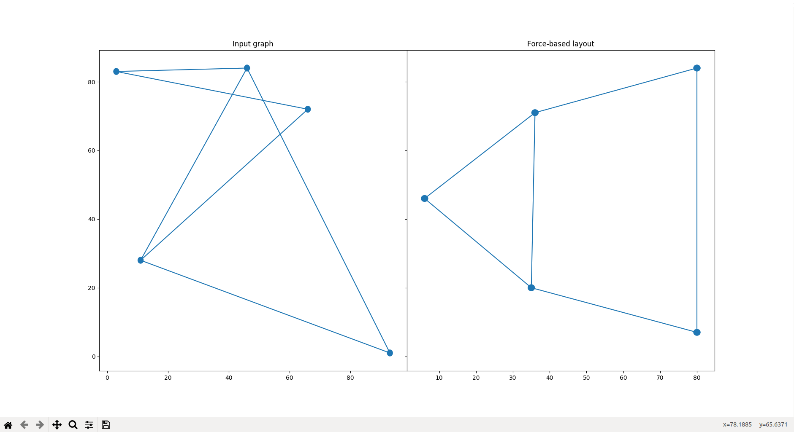
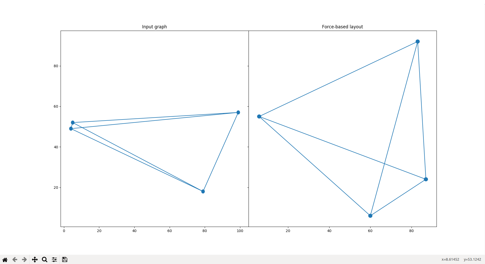
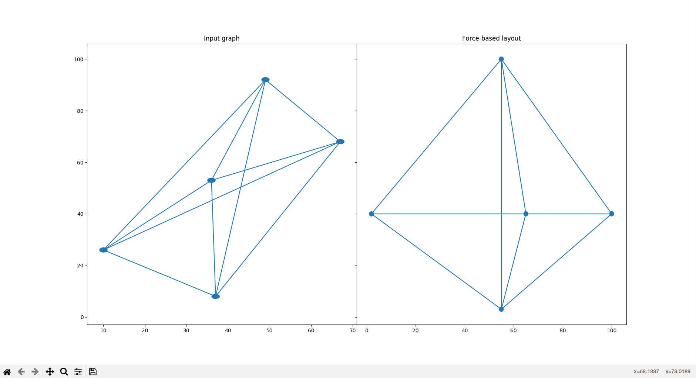

# EulerTikz

## Project Overview
EulerTikz is an implementation of graph drawing algorithms in Python3, with rendering in matplotlib. Currently, EulerTikz includes an implementation the force-based layout algorithm for simple connected undirected unlabelled graphs.

## Utilities
The dependencies include:
* Python 3.x.x
* Numpy
* matplotlib

## How to use
1. Run `python3 main.py`
2. Input graph in the format
```
<number of vertices> <number of edges>
<vertex> <vertex>
.
.
.
<vertex> <vertex>

```
where each pair of vertex labels preceding the first line denotes an edge.

## Force-based layout
Force-based layout algorithm simulates the idea of a physical system of attractive spring forces along edges and repulsive forces caused due to the vertices. Given a simple undirected graph $G$, we first compute the Laplacian matrix $L$ of $G$. Then, we find two sufficiently large eigenvalues of $L$ and apply appropriate linear adjustments to their corresponding eigenvectors. We then repeatedly apply the spring forces to every pair of vertices, forces are stronger between adjacent vertices than between nonadjacent vertices.

### Running time analysis
Let $G$ be a simple undirected graph of order $n$ and size $m$. Construction of the Laplacian $L$ of $G$ requires $O(n)$ operations. Eigenvalues can be found in $O(n)$ operations. Finally, applying forces between every pair of vertices takes $O(n^{2})$ time per step. Hence, the total running time of computing the graph drawing function is $O(kn^{2})$, where $k$ is the number of times spring forces are applied between every pair of vertices.

### Advantages
* simple to understand
* can detect symmetric representations

### Disadvantages
* not always optimal, cannot draw trees well
* does not necessarily minimize crossing number, for instance $Q_{3}$
* some graphs may require a large number of iterations to find a solution, hence the algorithm can practically be slow

### Examples
* $C_{4}$
    * 
* Cube graph
    * 
* House graph
    * 
* $K_{4}$
    * 
* $K_{5}$
    * 
* Peterson's graph
    * 
* Tree of order 4
    * 
* Tree of order 10
    * 

### Issues
* Modify force-based layout to draw any simple undirected graph by simply detecting components and ensuring components do not coincide with other components of the graph
* Implement spectral layout algorithm
